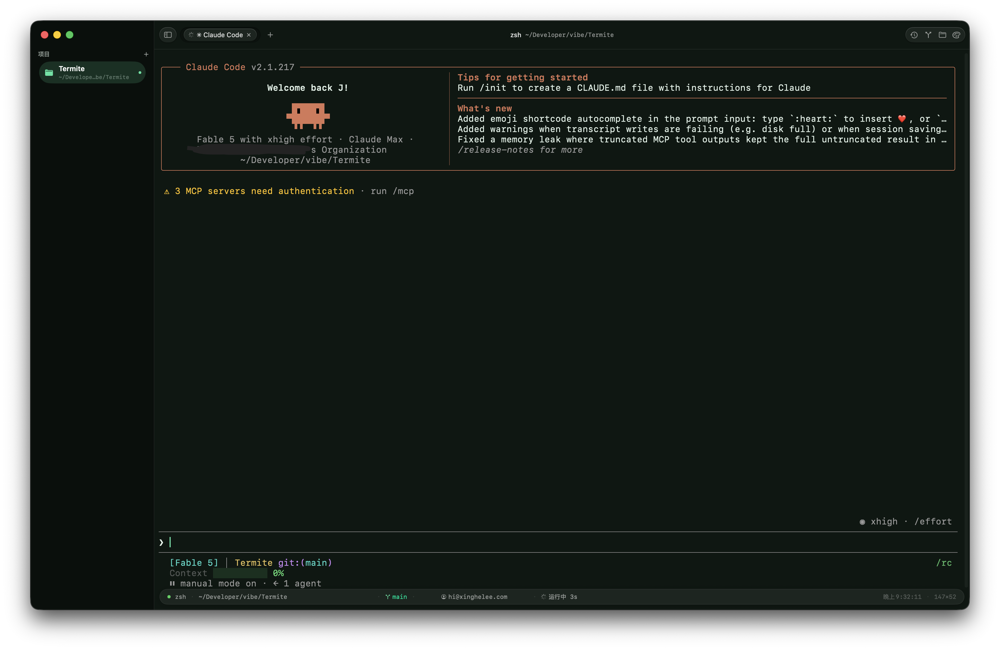

# Termite

[中文](README.md)

**A native terminal, written for macOS.**

The interface is SwiftUI from the ground up, not a wrapper; shell integration turns every command into a unit you can jump to and revisit; Git panel, infinite splits, command palette, and 20 themes work out of the box.



**[⬇️ Download the latest release](https://github.com/xinghelee/Termite/releases/latest)** — the DMG is notarized by Apple, so just drag it into Applications. Or use Homebrew:

```sh
brew install --cask xinghelee/tap/termite
```

- Requires macOS 15.0+
- Built with SwiftUI + AppKit; terminal engine is [SwiftTerm](https://github.com/migueldeicaza/SwiftTerm) (Metal GPU rendering)
- Unsandboxed, with full filesystem and process access — it behaves like the terminal you're used to

## Core features

### Session restore

- **Full multi-window restore**: reopen the app and window frames, focus, maximized pane, tabs and split layout, and scrollback all come back.
- New tabs inherit the current directory.

### Shell integration (auto-injected, zero config)

zsh / bash / fish get OSC 133 command markers hooked up automatically, which unlocks a set of command-level features:

- ⌘↑ / ⌘↓ jump between commands; ⌘⇧C copies the previous command's output
- Exit code and elapsed time for each command, live in the status bar
- A system notification when a long command (≥10s) finishes in the background
- Command history persisted to SQLite, ⌘⇧H to search it globally, with an auto-generated daily report

### Git integration

- ⌘G Git panel: SourceTree-style commit graph, word-level diff highlighting, blame, per-file history
- Stage / unstage / discard, branch switching, cherry-pick / revert
- Current branch always in the status bar (read straight from `.git/HEAD`, no subprocess) next to the commit identity — click to edit it

### Panels and navigation

- ⌘P command palette: fuzzy-search every action and theme
- ⌘O directory jumper, ⇧⌘E file browser (can create folders), sidebar project switching
- Quake-style dropdown terminal on a global hotkey, ⌃⌥⌘Space by default — no Accessibility permission needed
- Port manager panel; a `termite` CLI; drop a folder onto the Dock icon to open it in a new tab

### Terminal feel

- Infinitely nestable splits: ⌘⌥arrows to move between panes, ⇧⌘↩ to maximize one, broadcast input to every pane
- Drag to reorder tabs, or move a tab into its own window
- Paste protection: multi-line pastes and risky content (`rm -rf`, `sudo`, …) ask first
- Copy on select, middle-click paste, and a cursor that blinks only in the focused pane
- 20 hand-tuned themes that color the whole window chrome, not just the terminal area
- Built-in `imgcat` for inline images; session recording and playback in asciinema format
- Output diffing and a structured-output viewer

## Building from source

Requires [xcodegen](https://github.com/yonaskolb/XcodeGen):

```sh
xcodegen generate
xcodebuild -project Termite.xcodeproj -scheme Termite -configuration Release build
```

Or just `open Termite.xcodeproj` and run it from Xcode. The project has three targets:

| Target | Purpose |
|---|---|
| `Termite` | The app |
| `PtyHostDaemon` | `termite-ptyhost`, the PTY daemon (copied into the app bundle after building) |
| `TermiteTests` | Unit tests |

## Project layout

```
Termite/
  App/         entry point, main window, window chrome
  Core/        Terminal (rendering/themes/OSC 133) · Session (sessions/splits/shell integration) · Git · Parsing
  Features/    Terminal · Git · CommandPalette · FileBrowser · Sidebar
               DirectoryJumper · HistorySearch · Ports · QuickTerminal · Replay · Settings · MenuBar
PtyHostDaemon/ the daemon
PtyHostShared/ socket protocol shared by the app and the daemon
TermiteTests/  unit tests
```

Design notes (in Chinese) live in [DESIGN.md](DESIGN.md).
