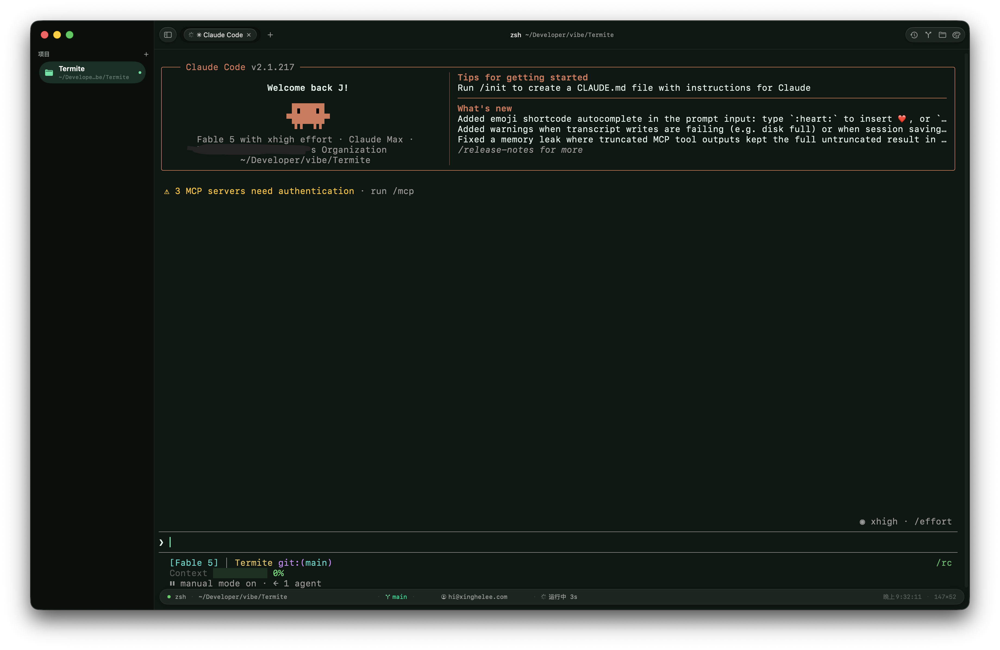

# Termite

macOS 原生终端。体验对标 Ghostty,靠**原生 SwiftUI 质感 + 深度 shell 集成的效率功能**做差异化。



**[⬇️ 下载最新版](https://github.com/xinghelee/Termite/releases/latest)** — DMG 已过 Apple 公证,拖进 Applications 即用

- 系统要求:macOS 15.0+
- 技术栈:SwiftUI + AppKit,终端引擎 [SwiftTerm](https://github.com/migueldeicaza/SwiftTerm)(Metal GPU 渲染)
- 无沙箱、完整文件系统与进程权限,和你习惯的终端行为完全一致

## 核心特性

### 会话保活与恢复

- **退出不杀会话**:`termite-ptyhost` 守护进程托管 PTY,⌘Q 退出 App 后 shell 继续运行,重新打开无缝接回;⌘W 才是真正结束会话
- **多窗口完整恢复**:窗口 frame、焦点、最大化状态、标签与分屏结构、scrollback 全量找回
- 新标签继承当前目录

### Shell 集成(自动注入,零配置)

zsh / bash / fish 自动挂钩 OSC 133 命令标记,带来一整套命令级能力:

- ⌘↑ / ⌘↓ 在命令之间跳转,⌘⇧C 一键复制上条命令输出
- 状态栏实时显示退出码与命令耗时
- 长命令(≥10s)后台完成时发系统通知
- 命令历史 SQLite 落盘,⌘⇧H 全局搜索,自动生成日报

### Git 集成

- ⌘G Git 面板:SourceTree 式图形历史泳道、词级高亮 diff、blame、单文件修改历史
- 暂存 / 取消暂存 / 丢弃、分支切换、cherry-pick / revert
- 状态栏常驻当前分支(直读 `.git/HEAD`,零子进程)与提交身份,点击即可编辑

### 面板与导航

- ⌘P 命令面板:模糊搜索所有动作与主题
- ⌘O 目录跳转器,⇧⌘E 文件浏览器(支持新建文件夹),侧边栏项目切换
- Quake 下拉终端:全局热键 ⌃⌥⌘Space(可自定义),无需辅助功能权限
- 端口管理面板;`termite` CLI;Dock 图标拖入文件夹直接开标签

### 终端手感

- 无限嵌套分屏:⌘⌥方向键导航、⇧⌘↩ 分屏最大化、广播输入到所有分屏
- 标签拖拽重排、标签移到新窗口
- 粘贴保护:多行 / `rm -rf` / `sudo` 等高危内容先确认
- 选中即复制、中键粘贴,仅聚焦 pane 光标闪烁
- 20 套精调主题,主题化整个窗口 chrome(不只终端区)
- 内置 `imgcat` 终端内联看图;asciinema 格式会话录制与回放
- 输出 Diff 对比、结构化输出查看器

## 从源码构建

依赖 [xcodegen](https://github.com/yonaskolb/XcodeGen):

```sh
xcodegen generate
xcodebuild -project Termite.xcodeproj -scheme Termite -configuration Release build
```

或直接 `open Termite.xcodeproj` 用 Xcode 跑。工程包含三个 target:

| Target | 说明 |
|---|---|
| `Termite` | 主 App |
| `PtyHostDaemon` | `termite-ptyhost` 会话保活守护进程(构建后拷入 App bundle) |
| `TermiteTests` | 单元测试 |

## 项目结构

```
Termite/
  App/         入口、主窗口、窗口 chrome
  Core/        Terminal(渲染/主题/OSC133) · Session(会话/分屏/shell 集成) · Git · Parsing
  Features/    Terminal · Git · CommandPalette · FileBrowser · Sidebar
               DirectoryJumper · HistorySearch · Ports · QuickTerminal · Replay · Settings · MenuBar
PtyHostDaemon/ 守护进程
PtyHostShared/ App 与守护进程共享的 socket 协议
TermiteTests/  单元测试
```

设计文档见 [DESIGN.md](DESIGN.md)。
