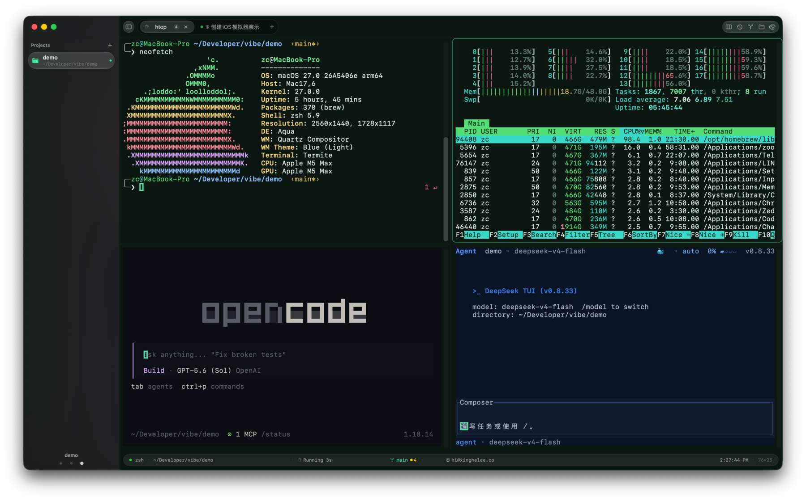
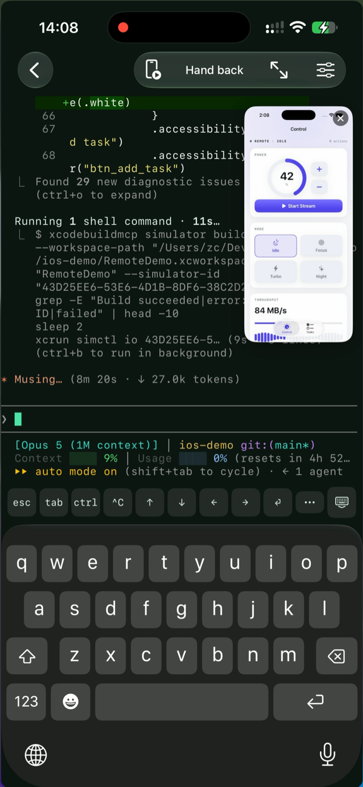
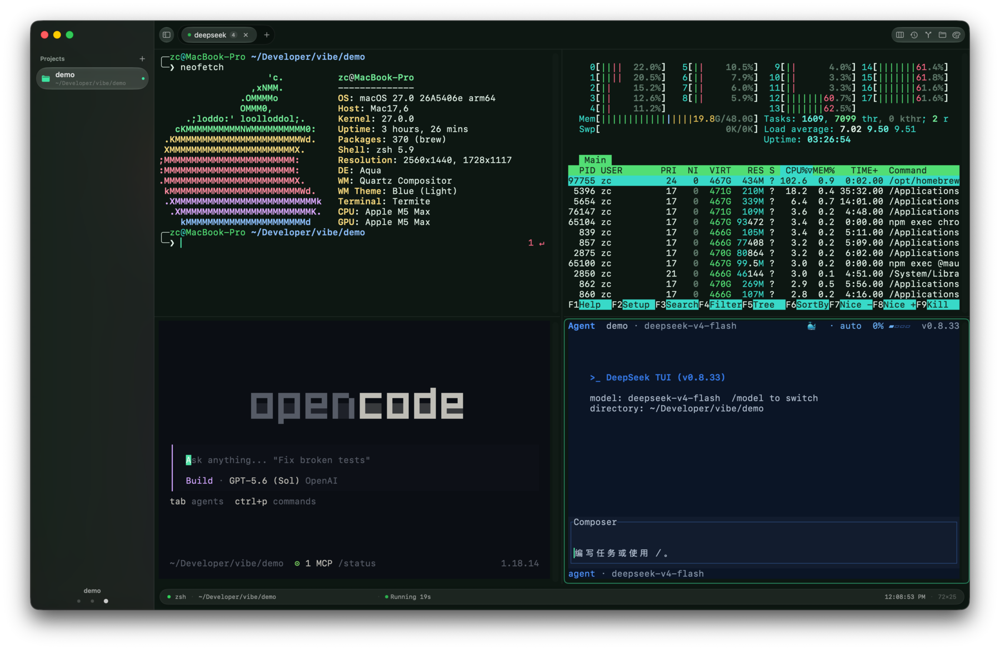
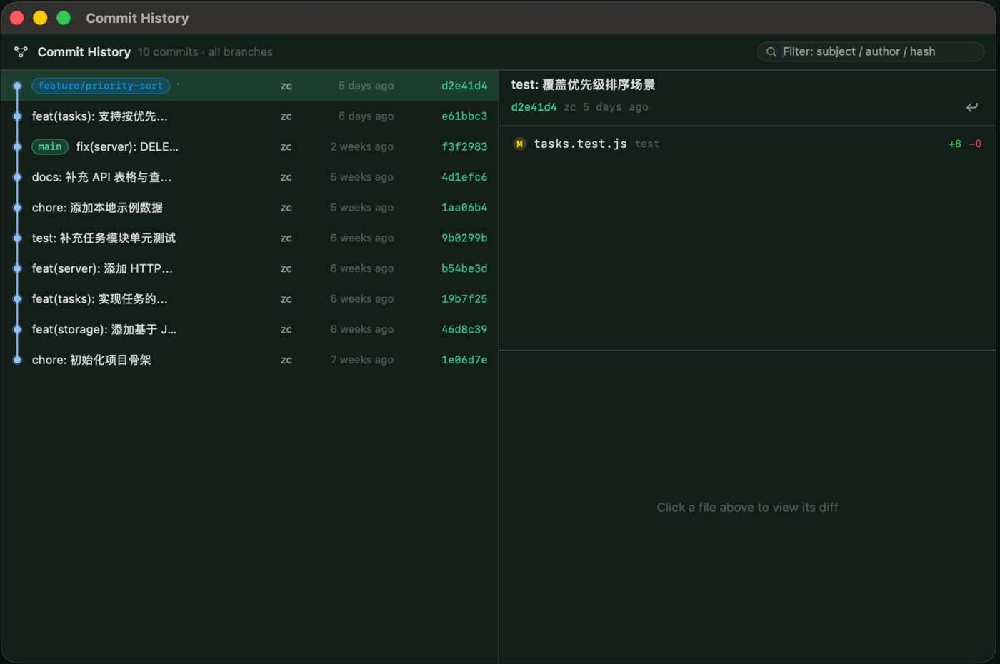
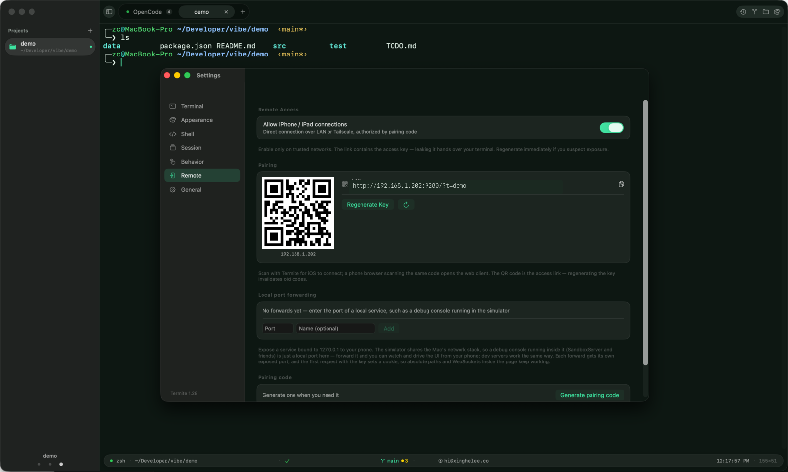
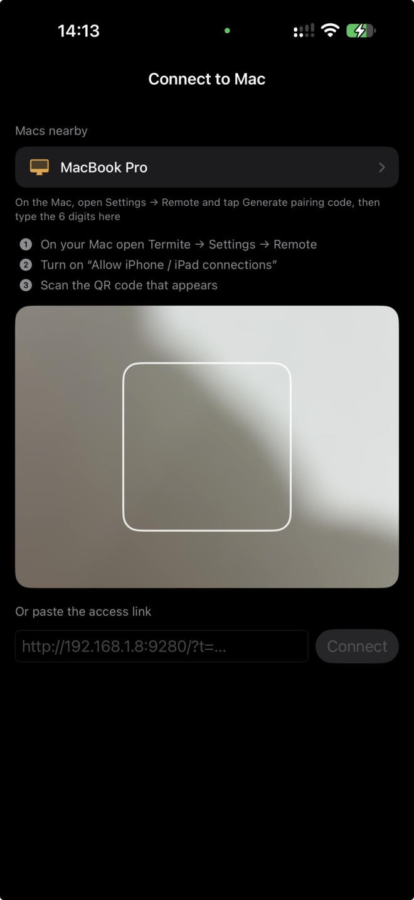
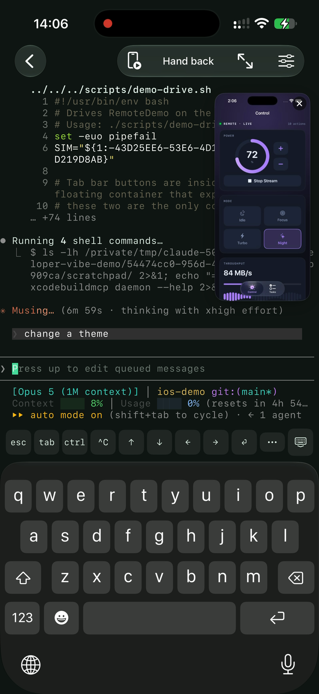

  

<h1 align="center">Termite</h1>

  <strong>A native terminal for macOS—and the control plane for parallel AI development workflows.</strong>

  <a href="README.zh-CN.md">简体中文</a>
  ·
  <a href="https://github.com/xinghelee/Termite/releases/latest">Download</a>
  ·
  <a href="#install">Install</a>
  ·
  <a href="#build-from-source">Build from source</a>

  
  
  
  

  

<table>
  <tr>
    <td width="50%" valign="top">
      <video src="https://github.com/user-attachments/assets/cd18f5d0-4465-4f60-9342-07e29974a225" width="100%" controls muted></video>
    </td>
    <td width="50%" valign="top">
      
    </td>
  </tr>
</table>

> The video shows an iPhone connecting to a Mac over a trusted LAN or Tailscale private network to preview and control an iOS Simulator in real time. Compatibility: **macOS 26.0 or later** on the Mac; **iOS / iPadOS 17.0 or later** on iPhone and iPad.

Termite brings terminals, nested panes, shell-aware command history, Git workflows, and private-network remote access into one native macOS workspace. Its job is not to open more terminal windows; it is to keep concurrent work visible, reachable, and under control.

It is built for developers and teams running planning, implementation, testing, and review in parallel. Give each AI agent a dedicated pane or <code>git worktree</code>, then follow its state, handle input, and complete Git work without leaving the workspace.

## Primary development environment

Termite is primarily developed and verified on the maintainer's current workstation:

| Component | Environment |
| --- | --- |
| Hardware | MacBook Pro · Apple M5 Max (18-core) · 48 GB unified memory |
| macOS | macOS 27.0 · build 26A5406e |
| Toolchain | Xcode 26.6 · Swift 6.3.3 · XcodeGen 2.46.0 |
| Shell | zsh 5.9 |
| Mobile verification | iOS 27.0 Simulator |

> This is the primary development setup, not the minimum requirement. The supported baseline remains **macOS 26.0+** for the Mac app and **iOS / iPadOS 17.0+** for the mobile client.

## See parallel work at a glance

Panes can be nested indefinitely. Carousel mode lays every pane in the current tab out as equal-width columns: inspect a task and the keyboard focus follows. Together with input-needed alerts, broadcast input, and session restoration, multi-task work does not degrade into a pile of lost windows.

- Create horizontal or vertical panes with <kbd>⌘D</kbd> / <kbd>⇧⌘D</kbd>, then press <kbd>⇧⌘\</kbd> for carousel mode.
- When an agent needs a response, its pane, the menu bar, and system notifications surface it; <kbd>⌘J</kbd> jumps to the pane waiting longest.
- New tabs inherit the current directory. Relaunch with your windows, tabs, pane layout, focus, and scrollback restored.
- Create or open a dedicated <code>git worktree</code> from a pane menu so concurrent changes never share the same working tree.

## Product tour

<table>
  <tr>
    <td width="38%" valign="middle">
      <h3>Pane carousel</h3>
      Keep terminals, live status, and several agents visible in a single tab. Browse with a trackpad gesture or <code>⌘←</code> / <code>⌘→</code>; focus follows the pane you inspect.
    </td>
    <td width="62%">
      
    </td>
  </tr>
  <tr>
    <td width="38%" valign="middle">
      <h3>Git work, beside the task</h3>
      A detached history window presents branch lanes, commits, and file diffs. Review history, switch branches, stage, or roll back changes without moving into a separate Git client.
    </td>
    <td width="62%">
      
    </td>
  </tr>
  <tr>
    <td width="38%" valign="middle">
      <h3>Remote access on trusted networks</h3>
      Enable it from <em>Settings → Remote</em>, then use a one-time pairing code to connect an iPhone, iPad, or browser. A LAN address may be visible; treat every access credential as terminal permission.
    </td>
    <td width="62%">
      
    </td>
  </tr>
  <tr>
    <td width="38%" valign="middle">
      <h3>Terminal and simulator from your phone</h3>
      Browse sessions, take input control, and see a simulator running on your Mac from an iPhone or iPad. Mobile keeps quick control keys and a full software keyboard close at hand.
    </td>
    <td width="62%" align="center">
      
      
    </td>
  </tr>
</table>

> These are real screens from the current build, with account details, the LAN address, and local demonstration paths shown as captured. The QR code and URL in the remote-access screenshot use a nonfunctional demo credential so a potentially live terminal-access key is never published.

## A terminal that understands commands

Termite automatically enables or injects shell integration for zsh, bash, and fish—without editing dotfiles. OSC 133 markers identify the start, end, exit status, and output boundary of each command, so history becomes navigable, searchable, and reusable.

- Use <kbd>⌘↑</kbd> / <kbd>⌘↓</kbd> to move between commands and <kbd>⇧⌘C</kbd> to copy the prior command's output.
- The status bar shows exit code, duration, working directory, and Git branch. Background long-running commands notify you when they finish.
- Command history is stored in SQLite. Search across sessions with <kbd>⇧⌘H</kbd> or generate a daily report to review the day.
- Inline images, output diffs, structured output, asciinema recording and playback, copy-on-select, and risky-paste confirmation are included.

## Development tools, kept in context

- **Git panel:** press <kbd>⌘G</kbd> for the commit graph, word-level diffs, blame, and file history. Stage, unstage, discard, switch branches, cherry-pick, and revert in place.
- **Workspace navigation:** <kbd>⌘P</kbd> command palette, <kbd>⌘O</kbd> directory jumper, <kbd>⇧⌘E</kbd> file browser, project sidebar, and port manager.
- **At home on macOS:** 20 themes cover the entire window; the global drop-down terminal defaults to <kbd>⌃⌥⌘Space</kbd>; install the <code>termite</code> command or drop a folder onto the Dock icon to open it.

## Remote access, only on networks you trust

Remote access is off by default and is designed for private networks you trust, including LAN and Tailscale. Paired devices receive a live session view; one mobile device can take input control, and the Mac can reclaim control at any time. You can also forward a local development service that listens only on <code>127.0.0.1</code> to already-paired devices.

An access link, QR code, or pairing code is equivalent to terminal access. Enable remote access only on trusted networks and regenerate the key immediately if it may have leaked.

## Keyboard shortcuts

| Action | Shortcut |
| --- | --- |
| New tab / horizontal pane / vertical pane | <kbd>⌘T</kbd> / <kbd>⌘D</kbd> / <kbd>⇧⌘D</kbd> |
| Move focus between panes | <kbd>⌥⌘←</kbd> <kbd>⌥⌘→</kbd> <kbd>⌥⌘↑</kbd> <kbd>⌥⌘↓</kbd> |
| Maximize pane / pane carousel | <kbd>⇧⌘↩</kbd> / <kbd>⇧⌘\</kbd> |
| Focus a pane awaiting input | <kbd>⌘J</kbd> |
| Command palette / directory jumper / command timeline | <kbd>⌘P</kbd> / <kbd>⌘O</kbd> / <kbd>⌘I</kbd> |
| Git panel / file browser / history search | <kbd>⌘G</kbd> / <kbd>⇧⌘E</kbd> / <kbd>⇧⌘H</kbd> |
| Copy prior command output / broadcast input | <kbd>⇧⌘C</kbd> / <kbd>⌥⌘B</kbd> |

Find more actions with <kbd>⌘P</kbd>, or browse the app menus.

## Install

### Download a release

Download the latest DMG from [GitHub Releases](https://github.com/xinghelee/Termite/releases/latest), then drag Termite into Applications.

### Homebrew

~~~sh
brew install --cask xinghelee/tap/termite
~~~

### Open directories from the command line

Install <code>termite</code> in **Settings → General → Command-line tools**, then open a directory in Termite from anywhere:

~~~sh
termite ~/Developer/my-project
~~~

The zsh shell integration includes a same-named function. After installing to <code>/usr/local/bin</code>, bash, fish, and scripts can use the command too.

## Build from source

### Requirements

- macOS 26.0 or later
- Xcode with the macOS 26 SDK
- [XcodeGen](https://github.com/yonaskolb/XcodeGen)

~~~sh
git clone https://github.com/xinghelee/Termite.git
cd Termite

xcodegen generate
xcodebuild -project Termite.xcodeproj -scheme Termite -configuration Debug build
xcodebuild -project Termite.xcodeproj -scheme Termite -destination 'platform=macOS' test
~~~

Alternatively, run <code>open Termite.xcodeproj</code>, select the <code>Termite</code> scheme in Xcode, then build and run.

## Project layout

~~~text
Termite/          macOS app: terminal, sessions, Git, workspaces, and settings
TermiteMobile/    iPhone and iPad remote client
PtyHostDaemon/    PTY daemon
PtyHostShared/    Local socket protocol shared by the app and daemon
RemoteWeb/        Embedded remote-access Web client
TermiteTests/     Unit tests
docs/assets/      Product screenshots and mobile demo
~~~

Termite is built with SwiftUI and AppKit, uses [SwiftTerm](https://github.com/migueldeicaza/SwiftTerm) for terminal and Metal-rendering capabilities, and manages the project with XcodeGen. The macOS app is not sandboxed so it can provide the full filesystem and process access a terminal requires.

## Contributing

Issues and pull requests are welcome. For bug reports, include reproduction steps, the Termite and macOS versions, shell type, and redacted terminal output where useful. Before submitting code, run the tests relevant to your change and do not commit <code>Termite.xcodeproj</code> or <code>DerivedData</code>, both of which are generated locally.

See [DESIGN.md](DESIGN.md) for product goals and technical trade-offs.

## License

Termite is released under [GNU GPL v3.0](LICENSE). You may use, modify, and redistribute it; redistributed modified versions must provide corresponding source code under the same license.
